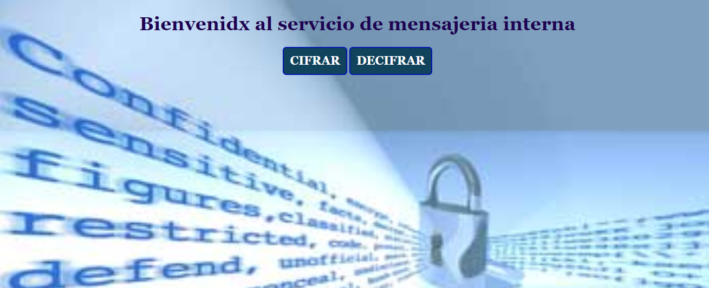

#### Encubiertos

Trabajas en un ambiente laboral donde por seguridad no puedes mencionar cierta información pues podria ser de alto riesgo. Se ha creado una aplicación que te permitira enviar esos mensajes y que el destinatario del mensaje pueda tener una clave para desemcriptarlo. de esa manera podras enviar tus mensajes de forma segura.

### Quiénes son los principales usuarios de producto.
Trabajadores de oficina, que desean mandar un mensaje oculto.

### Cuáles son los objetivos de estos usuarios en relación con tu producto.
Mandar un mensaje encriptado, que solo un destinatario especifico pueda decifrar.

### Cómo crees que el producto que estás creando está resolviendo sus problemas.
Con la implementación de este proyecto los usurios pueden mandar sus mensajes discreta y segura.

#### Interfaz de usuario (UI)

La interfaz debe permitir al usuario:
- Elegir un desplazamiento (_offset_) indicando cuántas posiciones queremos que el cifrado desplace cada caracter.
- Insertar un mensaje (texto) que queremos cifrar.
- Ver el resultado del mensaje cifrado.
- Insertar un mensaje (texto) a descifrar.
- Ver el resultado del mensaje descifrado.
